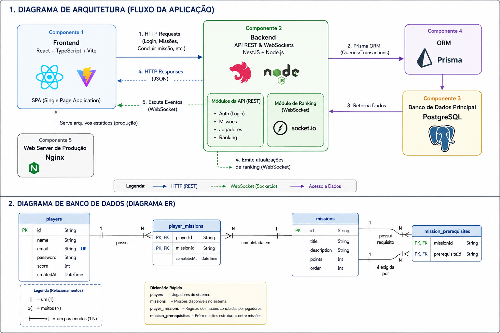

# 🏆 Projeto Missões e Ranking

Este repositório contém a aplicação completa em um modelo **Monorepo**, englobando o Frontend (React + Vite) e o Backend (NestJS). A infraestrutura é configurada via **Docker** para facilitar a execução do projeto em qualquer ambiente, minimizando a necessidade de configurações manuais.

## 🌍 Live Demo (Deploy)

A aplicação está hospedada e pode ser acessada online através do link:
👉 **[https://wesleyferreiradev.tech/](https://wesleyferreiradev.tech/)**

## 🚀 Tecnologias Utilizadas

- **Frontend:** React, TypeScript, Vite, Nginx (Produção)
- **Backend:** Node.js, NestJS, TypeScript, Prisma ORM
- **Banco de Dados:** PostgreSQL
- **Infraestrutura:** Docker, Docker Compose (Multi-stage builds)

---

## 🛠️ Decisões de Projeto (Desafio de Código)

Como este repositório é fruto de um desafio de código, algumas decisões foram tomadas com o objetivo de **facilitar a avaliação**:

1. **Variáveis de ambiente no `docker-compose.yml`**: Você notará que as variáveis de ambiente essenciais (como `DATABASE_URL` e `JWT_SECRET`) estão _hardcoded_ no arquivo `docker-compose.yml`. Isso foi feito intencionalmente para cumprir o requisito de "subir toda a aplicação apenas rodando `docker compose up`", sem que o avaliador precise criar arquivos `.env` manualmente na raiz.
2. **Arquivo `.env.test` versionado**: O arquivo `.env.test` dentro da pasta `backend` foi comitado e versionado no Git propositalmente. Ele contém configurações seguras e exclusivas para os testes automatizados (apontando para um schema específico do banco). Assim, a suíte de testes pode ser executada por qualquer pessoa imediatamente após o clone sem configuração prévia.
3. **Seed de Missões Iniciais**: Para cumprir o requisito de facilitar a avaliação, o projeto conta com um _seed_ configurado via Prisma (`prisma/seed.ts`). Ele se encarrega de popular o banco de dados com 10 missões previamente cadastradas, permitindo que a aplicação seja testada logo após o _start_ dos containers.

---

## 🏛️ Decisões Arquiteturais e Escolha da Stack

Para facilitar o entendimento do fluxo e da modelagem de dados, confira abaixo os diagramas da aplicação:



A stack do projeto foi montada pensando em resolver os requisitos do desafio técnico de forma pragmática. Seguem as motivações de cada escolha:

- **Estrutura em Monorepo:** Manter frontend e backend no mesmo repositório facilita a manutenção e o versionamento. Para a avaliação do teste técnico, é útil porque basta um único clone para ter acesso a tudo. Também ajuda a fazer commits atômicos de funcionalidades que envolvem tanto a API quanto a UI.
- **Backend (NestJS):** Escolhido pela boa adoção de mercado e documentação. Por ser um framework opinado, ele já traz uma estrutura de pastas e injeção de dependências prontas, o que poupa tempo de setup inicial. O Nest CLI também ajuda bastante na produtividade. Outro ponto que pesou a favor para o desafio foi o suporte nativo a WebSockets (com Socket.io), o que simplificou a implementação do requisito de Ranking em tempo real.
- **Banco de Dados e ORM (PostgreSQL + Prisma):** O PostgreSQL atende ao requisito obrigatório da stack do desafio. Junto com ele, optei pelo Prisma ORM pela tipagem estática de ponta a ponta com TypeScript e pela forma simples de lidar com transações no banco (_Prisma Client Transactions_). O uso de transações foi importante para resolver a regra de concorrência e evitar que um duplo clique compute a mesma missão duas vezes.
- **Frontend (React + Vite):** O React foi escolhido por familiaridade e pelo ecossistema maduro para criação de interfaces baseadas em componentes. O Vite foi utilizado devido ao _build_ mais rápido e HMR eficiente, melhorando o tempo de resposta durante o desenvolvimento.
- **Infraestrutura e Produção (Docker + Nginx):** O projeto usa Docker Compose para atender ao requisito de "subir tudo com um comando" e manter um ambiente de desenvolvimento prático. No frontend em produção, utilizei o Nginx. Como o servidor embutido do Vite serve apenas para desenvolvimento, o Nginx atua como um servidor web leve e comum no mercado para servir os arquivos estáticos gerados pelo _build_ do React.

---

## ⚙️ Como rodar o projeto em Desenvolvimento

O ambiente de desenvolvimento foi configurado para máxima produtividade. Ele utiliza *Hot-Reload* (volumes espelhados) tanto no Frontend quanto no Backend, permitindo que as alterações no código reflitam instantaneamente.

### Pré-requisitos

- [Docker](https://www.docker.com/) e Docker Compose instalados.

### Passos

1. **Clone o repositório:**
   ```bash
   git clone https://github.com/wesleyfsousa01/projeto_missoes_e_ranking.git
   cd projeto_missoes_e_ranking
   ```

2. **Suba a infraestrutura de desenvolvimento:**
   ```bash
   docker compose up --build -d
   ```

3. **Acesse a aplicação:**
   - Frontend (Vite): [http://localhost:5173](http://localhost:5173)
   - Backend (NestJS API): [http://localhost:3000/api](http://localhost:3000/api)
   - O banco de dados (Postgres) estará rodando na porta `5433` (mapeada para a `5432` interna).

---

## 🧪 Testes Automatizados (E2E)

A aplicação possui testes end-to-end (E2E) para cobrir o fluxo principal e garantir que as regras de negócio de concorrência e duplo clique funcionem conforme o esperado.

**Isolamento de Dados:** 
Para não poluir o banco de desenvolvimento/produção, os testes rodam no mesmo container do PostgreSQL, porém totalmente isolados em um schema diferente (`schema=test`). O script `npm run test:e2e` (definido no package.json) injeta automaticamente o arquivo `.env.test` antes de acionar o Prisma e o Jest.

### Como rodar os testes

**Dentro do container Docker (Recomendado se você não tem o Node/npm instalados localmente):**
Certifique-se de que a aplicação subiu com `docker compose up -d`, então execute:
```bash
docker exec -it missoes_api npm run test:e2e
```

**Fora do Docker (Direto na sua máquina local):**
Certifique-se de que o container do banco esteja rodando (para liberar a porta 5433 local).
```bash
cd backend
npm install
npm run test:e2e
```

---

## 🏗️ Como testar o build de Produção localmente

O ambiente de produção é otimizado. Ele descarta os servidores de desenvolvimento (Vite) e compila os arquivos para um servidor leve (Nginx) entregar a aplicação.

Para simular exatamente o que rodará no servidor de produção:

1. **Pare os containers de desenvolvimento (se estiverem rodando):**
   ```bash
   docker compose down
   ```

2. **Suba a infraestrutura mesclando a configuração base com o override de produção:**
   ```bash
   docker compose -f docker-compose.yml -f docker-compose.prod.yml up --build -d
   ```

3. **Acesse a aplicação otimizada:**
   - Frontend (Nginx): [http://localhost](http://localhost) (Rodando na porta 80 padrão)
   - Backend (NestJS): [http://localhost:3000/api](http://localhost:3000/api)
